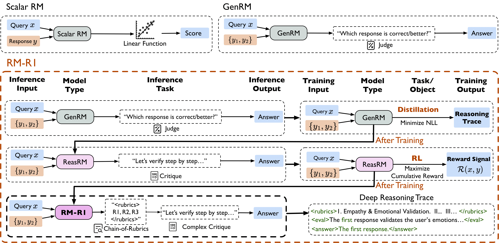

# RM-R1: **Reward Modeling as Reasoning**

[**🤗 Model**](https://huggingface.co/collections/gaotang/rm-r1-681128cdab932701cad844c8) | [**📊 Dataset**](https://huggingface.co/collections/gaotang/rm-r1-681128cdab932701cad844c8) | [**📖 Paper**](https://arxiv.org/pdf/2504.13958)



**RM‑R1** reframes reward modeling as a *reasoning* problem. Instead of emitting an opaque scalar, a Reasoning Reward Model (ReasRM) first *thinks out loud*—generating a structured rubric or solution—and then predicts the preference between two responses. This simple shift boosts both *interpretability* **and** *performance*: RM‑R1 beats prior open‑source reward models (e.g. GPT-4o, Llama3.1-405B) on multiple public benchmarks, while letting you read *why* the model prefers one answer over the other.  

## 🔍 Installation

### RM-R1 

```bash
# Install verl 
git clone https://github.com/volcengine/verl
cd verl
git checkout e49fb572bf85a8f0ef7124c898f509bd6d9832a1
pip install -e .

# Install vLLM
git clone https://github.com/vllm-project/vllm.git
cd vllm
git checkout ed6e9075d31e32c8548b480a47d1ffb77da1f54c
git cherry-pick caac5c2e597b1780c3df54a537c34e6061c32cff
export VLLM_COMMIT=ed6e9075d31e32c8548b480a47d1ffb77da1f54c
export VLLM_PRECOMPILED_WHEEL_LOCATION=https://wheels.vllm.ai/ed6e9075d31e32c8548b480a47d1ffb77da1f54c/vllm-1.0.0.dev-cp38-abi3-manylinux1_x86_64.whl
VLLM_USE_PRECOMPILED=1 pip install --editable .

# flash attention 
pip install flash-attn==2.7.2.post1 --no-build-isolation
```

Please install exactly like this, even if you install vllm before, or installed by verl, any other vllm version might fail.


### Distillation (SFT) environment (Optional)

If you would like to train from scratch and train the reasoning-distilled reasoning reward model, you can install the environment as follows. (We recommend using a separate environment)

```bash
conda create -n RmR1_sft python=3.11 -y 
conda activate RmR1_sft
pip install uv && uv pip install --upgrade pip
uv pip install vllm==0.7.2

cd train 
# Install OpenRLHF 
git clone https://github.com/OpenRLHF/OpenRLHF.git 
cd OpenRLHF 
uv pip install -e .
```

## Training

Training 

## Evaluation 

- coming soon

## Build Your Own Dataset 

- coming soon 


## Features 

- Support both SFT and RL training. 
- Support different RL frameworks. ✔️ 
- Support Slurm v.s. Non-Slurm Training. ✔️
- Support multi-node, multi-gpu training. ✔️ 
- Support different LLMs. ✔️ 
- Support evaluation of public benchmark. 


## Acknowledgement 

The concept of RM-R1 is inspired by [Deepseek-R1](https://github.com/deepseek-ai/DeepSeek-R1). Its implementation is built upon [veRL](https://github.com/volcengine/verl) and [OpenRLHF](https://github.com/OpenRLHF/OpenRLHF). We sincerely appreciate the efforts of these teams for their contributions to open-source research and development.

## Citations

```bibtex
@misc{2505.02387,
Author = {Xiusi Chen and Gaotang Li and Ziqi Wang and Bowen Jin and Cheng Qian and Yu Wang and Hongru Wang and Yu Zhang and Denghui Zhang and Tong Zhang and Hanghang Tong and Heng Ji},
Title = {RM-R1: Reward Modeling as Reasoning},
Year = {2025},
Eprint = {arXiv:2505.02387},
}
```
